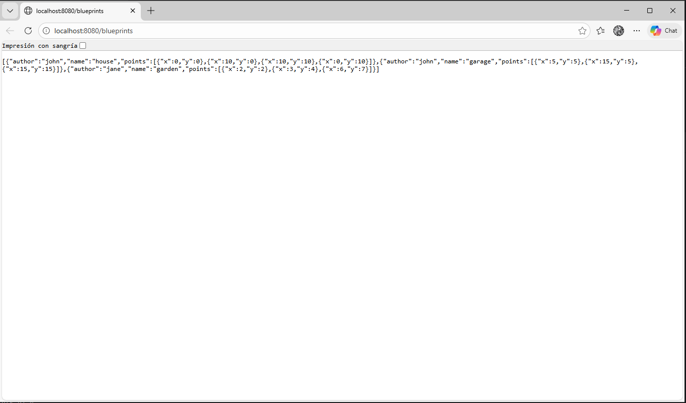
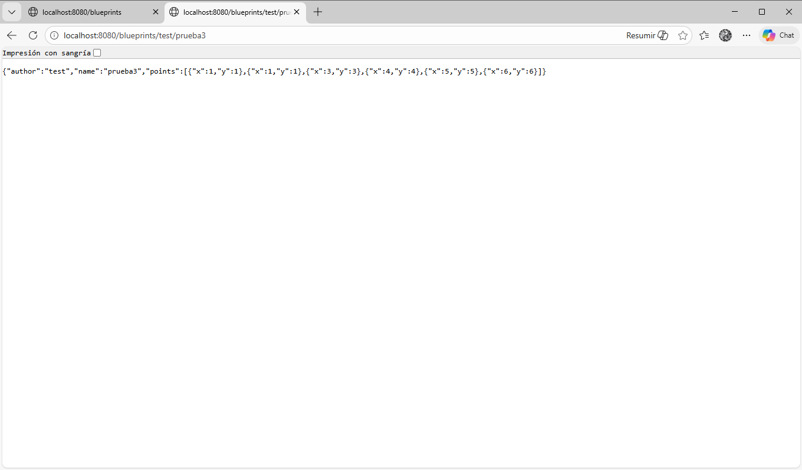
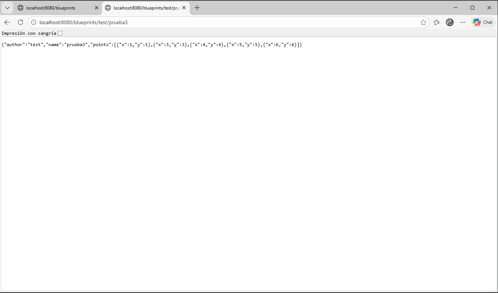
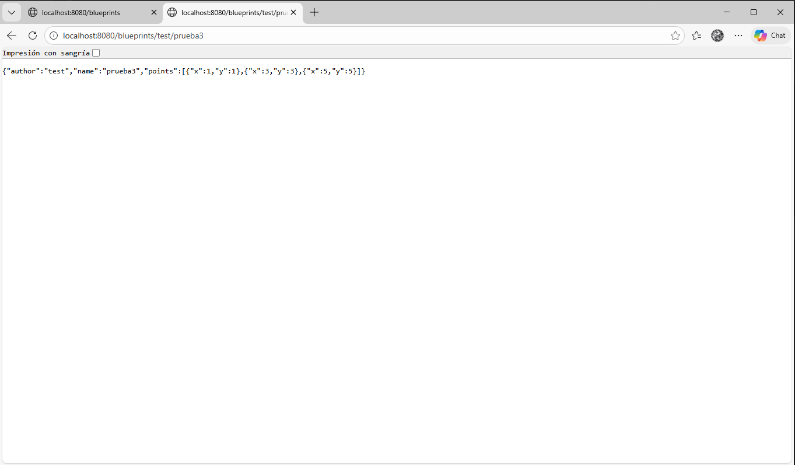
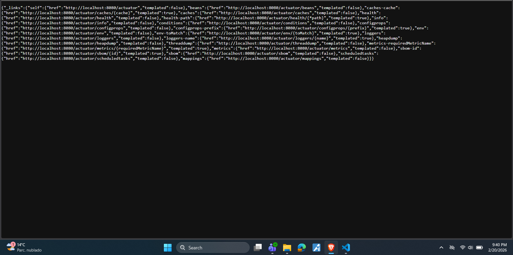

## Laboratorio #4 – REST API Blueprints (Java 21 / Spring Boot 3.3.x)
# Escuela Colombiana de Ingeniería – Arquitecturas de Software  

---

## 📋 Requisitos
- Java 21
- Maven 3.9+

## ▶️ Ejecución del proyecto
```bash
mvn clean install
mvn spring-boot:run
```
Probar con `curl`:
```bash
curl -s http://localhost:8080/blueprints | jq
curl -s http://localhost:8080/blueprints/john | jq
curl -s http://localhost:8080/blueprints/john/house | jq
curl -i -X POST http://localhost:8080/blueprints -H 'Content-Type: application/json' -d '{ "author":"john","name":"kitchen","points":[{"x":1,"y":1},{"x":2,"y":2}] }'
curl -i -X PUT  http://localhost:8080/blueprints/john/kitchen/points -H 'Content-Type: application/json' -d '{ "x":3,"y":3 }'
```

> Si deseas activar filtros de puntos (reducción de redundancia, *undersampling*, etc.), implementa nuevas clases que implementen `BlueprintsFilter` y cámbialas por `IdentityFilter` con `@Primary` o usando configuración de Spring.
---

Abrir en navegador:  
- Swagger UI: [http://localhost:8080/swagger-ui.html](http://localhost:8080/swagger-ui.html)  
- OpenAPI JSON: [http://localhost:8080/v3/api-docs](http://localhost:8080/v3/api-docs)  

---

## 🗂️ Estructura de carpetas (arquitectura)

```
src/main/java/edu/eci/arsw/blueprints
  ├── model/         # Entidades de dominio: Blueprint, Point
  ├── persistence/   # Interfaz + repositorios (InMemory, Postgres)
  │    └── impl/     # Implementaciones concretas
  ├── services/      # Lógica de negocio y orquestación
  ├── filters/       # Filtros de procesamiento (Identity, Redundancy, Undersampling)
  ├── controllers/   # REST Controllers (BlueprintsAPIController)
  └── config/        # Configuración (Swagger/OpenAPI, etc.)
```

> Esta separación sigue el patrón **capas lógicas** (modelo, persistencia, servicios, controladores), facilitando la extensión hacia nuevas tecnologías o fuentes de datos.

---

## 📖 Actividades del laboratorio

### 1. Familiarización con el código base
- Revisa el paquete `model` con las clases `Blueprint` y `Point`.
Point es un simple record con dos coordenadas x e y. Blueprint representa un plano con autor, nombre y una lista de puntos. Usa equals y hashCode basados solo en autor y nombre, lo que significa que dos blueprints son iguales si tienen el mismo autor y nombre, sin importar sus puntos.
- Entiende la capa `persistence` con `InMemoryBlueprintPersistence`.  
Implementa la interfaz BlueprintPersistence y almacena los blueprints en memoria usando un ConcurrentHashMap, lo que la hace thread-safe. La clave del mapa es autor:nombre. Ya trae tres blueprints de ejemplo (john/house, john/garage, jane/garden). Expone operaciones para guardar, buscar por autor, buscar por autor+nombre, listar todos y agregar puntos.
- Analiza la capa `services` (`BlueprintsServices`) y el controlador `BlueprintsAPIController`.
BlueprintsServices actúa como intermediario entre el controlador y la persistencia, además aplica un filtro (BlueprintsFilter) sobre los blueprints antes de retornarlos. El controlador BlueprintsAPIController expone la API REST y delega toda la lógica al servicio.

### 2. Migración a persistencia en PostgreSQL
- Configura una base de datos PostgreSQL (puedes usar Docker).  

  Para la base de datos usé Docker con un docker-compose.yml que levanta PostgreSQL 16 con el usuario, la contraseña y la base de datos ya listos, entonces con un simple docker compose up -d ya queda todo funcionando, sin tener que instalar nada más


- Implementa un nuevo repositorio `PostgresBlueprintPersistence` que reemplace la versión en memoria.  

  Creé la clase PostgresBlueprintPersistence usando Spring Data JPA para conectarme a PostgreSQL, también hice BlueprintEntity y PointEmbeddable, que son las clases que JPA usa para mapear los objetos a tablas, y BlueprintJpaRepository, que básicamente genera las consultas SQL automáticamente, le puse @Primary para que Spring use esta implementación en vez de la que estaba en memoria, pero sin borrar nada de lo anterior


- Mantén el contrato de la interfaz `BlueprintPersistence`.  

  PostgresBlueprintPersistence implementa exactamente la misma interfaz BlueprintPersistence, con los mismos métodos (saveBlueprint, getBlueprint, getBlueprintsByAuthor, getAllBlueprints, addPoint), gracias a eso BlueprintServices y el resto de la aplicación no necesitaron ningún cambio y todo siguió funcionando igual como podemos ver en la siguiente imagen:
  

### 3. Buenas prácticas de API REST
- Cambia el path base de los controladores a `/api/v1/blueprints`.  
- Usa **códigos HTTP** correctos:  
  - `200 OK` (consultas exitosas).  
  - `201 Created` (creación).  
  - `202 Accepted` (actualizaciones).  
  - `400 Bad Request` (datos inválidos).  
  - `404 Not Found` (recurso inexistente).  
- Implementa una clase genérica de respuesta uniforme:
  ```java
  public record ApiResponse<T>(int code, String message, T data) {}
  ```
  Ejemplo JSON:
  ```json
  {
    "code": 200,
    "message": "execute ok",
    "data": { "author": "john", "name": "house", "points": [...] }
  }
  ```

### 4. OpenAPI / Swagger
- Configura `springdoc-openapi` en el proyecto.  
- Expón documentación automática en `/swagger-ui.html`.  
- Anota endpoints con `@Operation` y `@ApiResponse`.

### 5. Filtros de *Blueprints*
- Implementa filtros:
  - **RedundancyFilter**: elimina puntos duplicados consecutivos.  

    Este ya estaba hecho solo se activa cuando corres la app con el perfil redundancy, básicamente recorre la lista de puntos y elimina los que estén repetidos justo después del anterior, O sea, si tienes (1,1),(1,1),(3,3) lo deja en (1,1),(3,3), solo borra los repetidos consecutivos, si todos los puntos son diferentes no toca nada

  - **UndersamplingFilter**: conserva 1 de cada 2 puntos.  

    Este también ya estaba implementado y se activa con el perfil undersampling, es más fuerte que el anterior porque simplemente se queda con 1 de cada 2 puntos (los de índice par), sin importar si están repetidos o no, entonces si tienes 6 puntos siempre te va a devolver 3


- Activa los filtros mediante perfiles de Spring (`redundancy`, `undersampling`).  

    Para hacer una comparacion de los diferentes filtros inyectamos una nueva consulta y asi es como se ve normalmente:
  
    Asi es como se ve con el filtro de Redundancy:
  
    Y asi es como se ve con el filtro de Undersampling:
  

### 6. Pruebas
Se implementan pruebas de integracion del controlador REST en la clase BlueprintsAPIControllerTest. Tambien se deja funcionando Actuator para las metricas de la API.

---

## ✅ Entregables

1. Repositorio en GitHub con:  
   - Código fuente actualizado.  
   - Configuración PostgreSQL (`application.yml` o script SQL).  
   - Swagger/OpenAPI habilitado.  
   - Clase `ApiResponse<T>` implementada.  

2. Documentación:  
   - Informe de laboratorio con instrucciones claras.  
   - Evidencia de consultas en Swagger UI y evidencia de mensajes en la base de datos.  
   - Breve explicación de buenas prácticas aplicadas.  

---

## 📊 Criterios de evaluación

| Criterio | Peso |
|----------|------|
| Diseño de API (versionamiento, DTOs, ApiResponse) | 25% |
| Migración a PostgreSQL (repositorio y persistencia correcta) | 25% |
| Uso correcto de códigos HTTP y control de errores | 20% |
| Documentación con OpenAPI/Swagger + README | 15% |
| Pruebas básicas (unitarias o de integración) | 15% |

**Bonus**:  

- Imagen de contenedor (`spring-boot:build-image`).  
- Métricas con Actuator.  